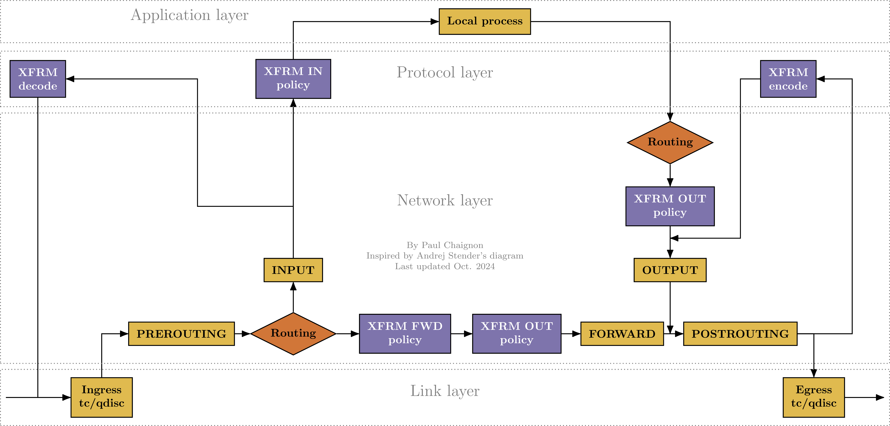

## 网络

### Network Namespace
在我的理解中，每一个network namespace 都需要一个网卡，所以之前在docker的实现中，为容器设置namespace的时候都配置了一个虚拟网卡。而且根据kmesh的代码，似乎内核在处理network namespace的时候，也就是进出network namespace的时候，在虚拟网卡上会触发和物理网卡一样的系统调用。

### Netfilter
参考：[你知道吗？Linux中的iptables到底是什么？netfilter又是什么？ 白话iptables工作原理 ｜097](https://www.bilibili.com/video/BV1qNKcz8Eb1/?spm_id_from=333.337.search-card.all.click)

[Nftables - 数据包流和 Netfilter 钩子](https://www.cnblogs.com/lsgxeva/p/17932539.html)

**核心**：五链四表。

**五链**: Linux Netfilter中的 `prerouting`, `input`, `forward, output`, 和 `postrouting` 链。作用在网络层和传输层。

**四表**: `filter`, `nat`, `mangle`, 和 `raw` 表。每个表包含多个链。

#### 五链

**PREROUTING**
- 作用层级: 网络层 (Layer 3) 和 传输层 (Layer 4)。
- 触发时机: 当一个数据包从任何网络接口进入系统时，在内核进行路由决策（即判断数据包是发往本机还是需要转发）之前，会立即经过此链。
- 主要用途:
目标网络地址转换 (DNAT): 这是PREROUTING最常见的用途。例如，将访问防火墙公网IP:80的数据包，修改其目标地址为内网某台Web服务器的IP:8080。这个修改IP地址的操作是典型的Layer 3行为，而修改端口号是Layer 4行为。
原始包过滤: 在路由前对数据包进行标记或过滤。

**INPUT**
- 作用层级: 网络层 (Layer 3) 和 传输层 (Layer 4)。
- 触发时机: 在经过PREROUTING链和路由决策后，如果内核确认该数据包的目标是本机（即发往本机上运行的某个应用程序），数据包就会进入INPUT链。
- 主要用途:
保护本机服务: 这是最核心的防火墙功能。控制哪些外部IP地址可以访问本机的哪些端口。例如，只允许特定IP访问SSH的22端口。这同时利用了Layer 3（源IP）和Layer 4（目标端口）的信息。

**FORWARD**
- 作用层级: 网络层 (Layer 3) 和 传输层 (Layer 4)。
- 触发时机: 在经过PREROUTING链和路由决策后，如果内核确认该数据包的目标不是本机，而是需要经由本机转发到另一个网络接口，数据包就会进入FORWARD链。
- 主要用途:
实现路由转发过滤: 当Linux主机作为路由器或网关时，FORWARD链用于过滤流经它的数据包。例如，控制内网用户可以访问外网的哪些服务，或者阻止某些外部流量进入内网。这同样是基于Layer 3（源/目标IP）和Layer 4（端口、协议）的策略。

**OUTPUT**
- 作用层级: 网络层 (Layer 3) 和 传输层 (Layer 4)。
- 触发时机: 当本机上运行的任何应用程序生成一个数据包并向外发送时，该数据包在进行路由决策之前会经过OUTPUT链。
- 主要用途:
控制本机对外访问: 限制本机应用程序向外发起连接。例如，禁止服务器主动连接外部的某个恶意IP地址，或者只允许root用户访问外网。
本地流量重定向: 可以对本地产生的流量进行DNAT，虽然这种用法不常见。

**POSTROUTING**
- 作用层级: 网络层 (Layer 3) 和 传输层 (Layer 4)。
- 触发时机: 当任何一个准备离开本机的数据包（无论是本机产生的还是转发的）在即将被发送到网络接口之前，会经过此链。这是数据包离开内核前的最后一站。
- 主要用途:
源网络地址转换 (SNAT/MASQUERADE): 这是POSTROUTING最核心的用途。例如，将所有来自内网的数据包的源IP地址，修改为防火墙的公网IP地址，从而实现内网共享上网。修改源IP地址是典型的Layer 3操作。

### 内核网络数据包的接收流程

### IPsec
参阅 [IPsec](https://www.zhuanlan.zhihu.com/p/44874772)。[Linux XFRM Reference Guide for IPsec](https://pchaigno.github.io/xfrm/2024/10/30/linux-xfrm-ipsec-reference-guide.html)。
**kmesh 中的 IPsec**，见项目的kmesh/docs/proposal/kmesh_support_encrypt.md文件。

IPsec 是一种网络安全协议，用于提供IP层的安全性。IPsec提供了两种安全机制**认证**和**加密**。
IPsec还需要有密钥的管理和交换功能。
IPsec的两种工作模式：
1. **传输模式**：只对IP数据包的有效载荷进行加密和认证，IP头部不变。
2. **隧道模式**：对整个IP数据包进行加密和认证，IP头部被替换为新的IP头部。根据我的理解，隧道会有一个自己的IP地址，数据包会被封装在一个新的IP数据包中，新的IP数据包的源IP地址是隧道的IP地址。

IPSec的的设置是单向的。

### IPsec协议组
IPsec协议组包括：
1. **AH**（Authentication Header）：提供数据包的认证和完整性保护，但不提供加密。可以单独使用，也可以在隧道模式下，或与ESP一起使用。
2. **ESP**（Encapsulating Security Payload）：定义了加密和和可选认证的应用方法。由三部分组成：ESP头部、ESP有效载荷和ESP可选尾部。头部包含两部分：安全策略索引和序列号。ESP有效载荷是加密后的数据包内容。尾部包含填充和认证数据。
3. **IKE**（Internet Key Exchange）：主要是对密钥交换进行管理，主要包括三个功能：
    - **密钥协商**：对使用的协议、就爱密算法和密钥进行协商
    - **密钥交换**：方便的密钥交换机制
    - **跟踪**： 对以上的这些约定进行跟踪。

### IPsec的工作模式
IPsec的工作模式有两种：**传输模式**和**隧道模式**。
1. **传输模式**：只对IP数据包的有效载荷进行加密和认证，IP头部不变。
2. **隧道模式**：对整个IP数据包进行加密和认证，IP头部被替换为新的IP头部。

### IPSec 的数据包传输流程
ipsec的传输流程可以参考*Linux XFRM Reference Guide for IPsec*中的图片如下

数据包解密的过程不依赖于Policy，首先是找到对应的State进行解密。
